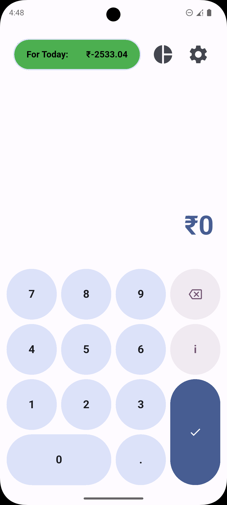
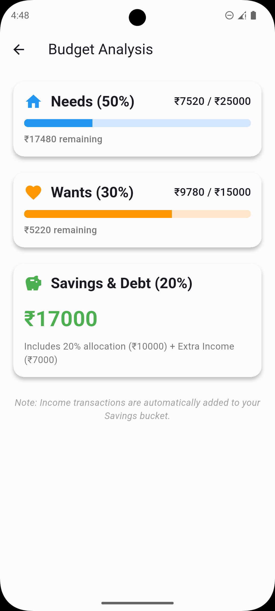
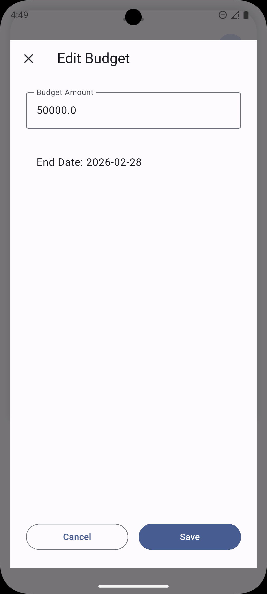
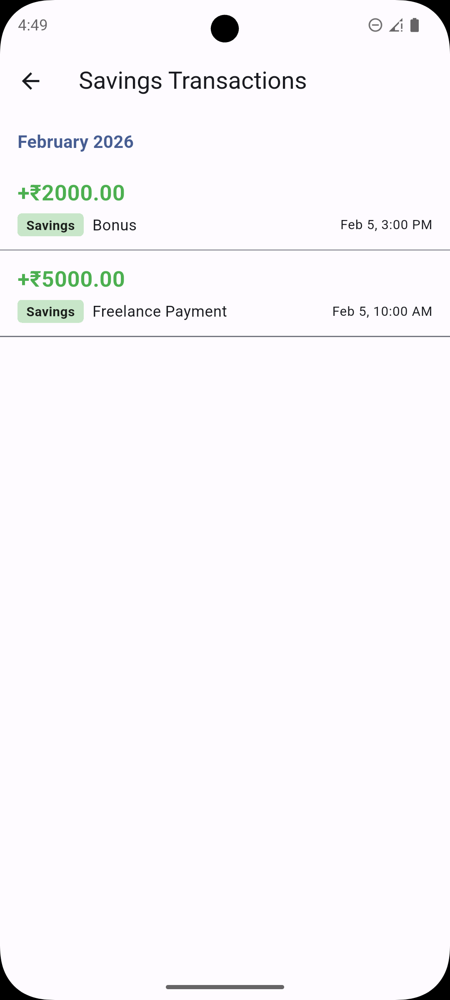

# BudgetLens

<p align="center">
  
</p>

<p align="center">
  <b>A smart personal budgeting app with dynamic daily spending allowance, built for Android with Flutter.</b>
</p>

<p align="center">
  <a href="https://flutter.dev">
    
  </a>
  <a href="https://dart.dev">
    
  </a>
  <a href="https://github.com/bkk31">
    
  </a>
</p>

<p align="center">
  <a href="#about">About</a> •
  <a href="#features">Features</a> •
  <a href="#screenshots">Screenshots</a> •
  <a href="#installation">Installation</a> •
  <a href="#tech-stack">Tech Stack</a> •
  <a href="#license">License</a>
</p>

---

## 📖 About

**BudgetLens** is a smart personal budgeting application designed to help you manage your finances with a **dynamic daily spending allowance**. Unlike traditional budgeting apps with fixed daily limits, BudgetLens adapts to your spending patterns by recalculating your allowance based on your remaining budget and days left in the cycle.

The app leverages **Material You** dynamic theming to seamlessly adapt to your device's wallpaper colors, providing a personalized and modern user experience. All your financial data stays **private** and is stored locally on your device.

> [!NOTE]
> Inspired by [Buckwheat](https://github.com/danilkinkin/buckwheat), BudgetLens brings intelligent budgeting to Android with a clean, intuitive interface.

## ✨ Features

- **🎨 Material You Design** - Fully adapts to your device's system colors (Android 12+).
- **💰 Dynamic Daily Allowance** - Automatically recalculates based on remaining budget and days left.
- **📊 Budget Analysis** - Visualize your spending patterns with categorized breakdowns (Needs, Wants, Savings).
- **📝 Transaction Management** - Easily log expenses and income with category tagging.
- **📅 Flexible Budget Periods** - Set custom budget cycles (weekly, monthly, or custom dates).
- **💾 Backup & Restore** - Export and import your budget data as JSON files.
- **🔒 Privacy First** - All data stays on your device. No cloud uploads, no tracking.
- **⚡ Fast & Responsive** - Built with Flutter's high-performance rendering engine.

## 📱 Screenshots

|                             Dashboard (For Today)                             |                             Dashboard (Total Left)                             |                                 All Transactions                                  |
| :---------------------------------------------------------------------------: | :----------------------------------------------------------------------------: | :-------------------------------------------------------------------------------: |
|  |  |  |

|                               Budget Analysis                                |                                   Settings                                   |                                 Edit Budget                                 |
| :--------------------------------------------------------------------------: | :--------------------------------------------------------------------------: | :-------------------------------------------------------------------------: |
|  |  |  |

|                              Needs Transaction                              |                              Wants Transaction                              |                               Savings Transaction                               |
| :-------------------------------------------------------------------------: | :-------------------------------------------------------------------------: | :-----------------------------------------------------------------------------: |
|  |  |  |

## 🛠 Installation

To run BudgetLens locally, you'll need [Flutter](https://flutter.dev/docs/get-started/install) installed.

1.  **Clone the repository:**

    ```bash
    git clone https://github.com/bkk31/budgetlens.git
    cd budgetlens/budgetlens
    ```

2.  **Install dependencies:**

    ```bash
    flutter pub get
    ```

3.  **Run the app:**

    ```bash
    flutter run
    ```

4.  **(Optional) Build the release APK:**
    ```bash
    flutter build apk --release
    ```

## 🏗 Tech Stack

BudgetLens is built with carefully selected Flutter packages:

- [**Flutter**](https://flutter.dev) - UI Toolkit.
- [**provider**](https://pub.dev/packages/provider) - State management solution.
- [**shared_preferences**](https://pub.dev/packages/shared_preferences) - Local data persistence.
- [**dynamic_color**](https://pub.dev/packages/dynamic_color) - Material You dynamic theming.
- [**intl**](https://pub.dev/packages/intl) - Internationalization and date formatting.
- [**uuid**](https://pub.dev/packages/uuid) - Unique transaction ID generation.
- [**share_plus**](https://pub.dev/packages/share_plus) - Native sharing capabilities.
- [**file_picker**](https://pub.dev/packages/file_picker) - File selection for backup restore.
- [**path_provider**](https://pub.dev/packages/path_provider) - Local file system access.
- [**permission_handler**](https://pub.dev/packages/permission_handler) - Permission handling.
- [**google_fonts**](https://pub.dev/packages/google_fonts) - Custom typography.
- [**cupertino_icons**](https://pub.dev/packages/cupertino_icons) - iOS-style icons.

## 📂 Project Structure

```bash
budgetlens/
 ├── lib/
 │   ├── main.dart                # App entry point and root widget
 │   ├── build_provider.dart      # State management with Provider
 │   ├── calculator.dart          # Core dynamic budgeting logic
 │   ├── models.dart              # Data models (Transaction, BudgetState)
 │   ├── screens/                 # UI screens (Dashboard, Setup, Transactions, Analysis, Settings)
 │   └── widgets/                 # Reusable UI components
 ├── assets/                      # Application assets (icons, screenshots)
 └── pubspec.yaml                 # Dependencies and project metadata
```

## 🤝 Contributing

Contributions are welcome! If you have suggestions or want to report a bug, please open an issue or submit a pull request.

1.  Fork the repository.
2.  Create your feature branch (`git checkout -b feature/amazing-feature`).
3.  Commit your changes (`git commit -m 'Add some amazing feature'`).
4.  Push to the branch (`git push origin feature/amazing-feature`).
5.  Open a Pull Request.

## 🙏 Acknowledgments

- Inspired by [Buckwheat](https://github.com/danilkinkin/buckwheat) - A beautiful budgeting app.
- The Flutter & Dart teams for the amazing framework.
- The open-source community ❤️

## 📄 License

Distributed under the GNU General Public License v3.0. See `LICENSE` for more information.

## ✉️ Contact

- **Bhargava K K** — [bkk31](https://github.com/bkk31)
- **Email** - bhargavakk13@gmail.com
- **Project Link**: [https://github.com/bkk31/budgetlens](https://github.com/bkk31/budgetlens)

---

[](https://github.com/bkk31/budgetlens/releases)
